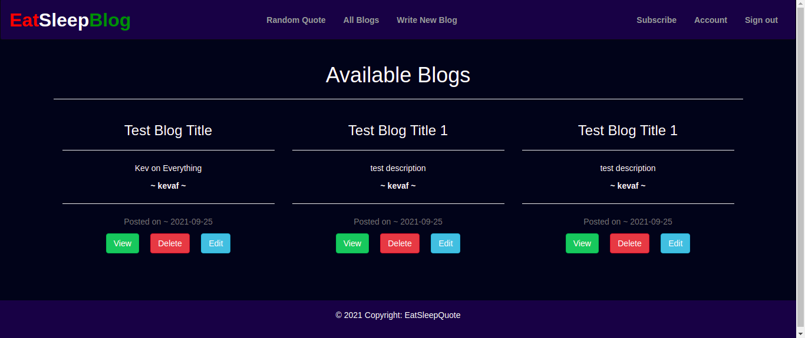
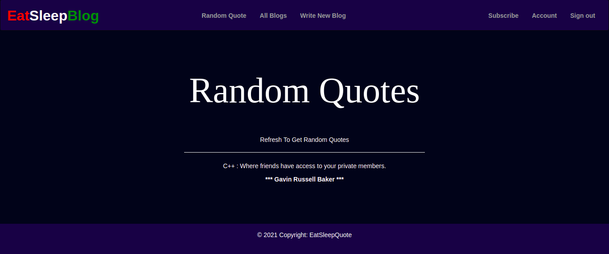

# EatSleepBlog

This is a personal blogging website where you can create and share your opinions and other users can read and comment on them.

## Description.
This is a Ptython built web app that allows a user to create a blog post and have it posted only after signing up and logging in. The web app provides a list of blogs posted by other users. As a userr you can be able to review blogs and comment on them whereas a writer can be able to review on coments and delete undesired ones and make edits to the blogs.

## Author & Contact Information.
This web app was created by Kevin Kipyegon. If you have any suggestions or improvements you can reach the author via mail at kevin.kipyegon@student.moringaschool.com

## Technologies Used
1. Python
2. Flask
3. Heroku - Deployment
4. HTML
5. CSS/Bootstrap

## Installation
<li>Clone the Repository
<ul> - git clone: https://github.com/kevaf/Eat-Sleep-Blog.git  
- cd NewsCatchUp  
- Open with desired code editor(Recommended VS Code)  
- Install requirements  
- Run: chmod a+x start.sh  
- Run: ./start.py

## User Stories
1. As a user, I would like to see the blogs other people have posted.
2. As a user, I would like to vote on the blog they liked and give it a downvote or upvote.
3. As a user, I would like to be signed in for me to leave a comment
4. As a user, I would like to receive a welcoming email once I sign up.
5. As a user, I would like to view the blogs I have created in my profile page.
6. As a user, I would like to comment on the different pitches and leave feedback.
7. As a user, I would like to submit a blog in any category.
8. As a user, I would like to view the different categories.

## Screenshots

## Liscence.
This is an open source project avaiable under the [MIT Liscence](LISCENCE).